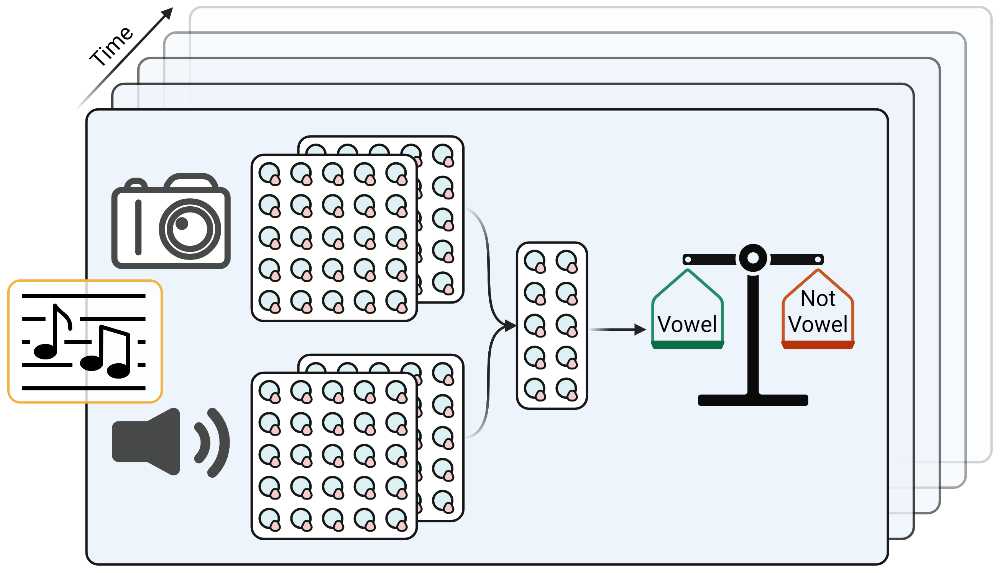

# vowel-xmodal-pcn
Use multimodal predictive coding networks to detect vowel boundaries in child-directed song.

## Summary
This project uses a multimodal predictive coding network, implemented in `omni-pcn`, to find vowel boundaries in
audiovisual recordings of child-directed song. It is intended to help human coders in situations where either the audio
or video signal is degraded or absent.

## Dependencies
`omni-pcn`: https://github.com/nsdumont/omni-pcn

## BrainHack 2026 goals
In BrainHack 2026, we will aim to accomplish the following steps:
1) Familiarize participants with the `omni-pcn` package
2) Build an initial architecture capable of handling time-dependent visual and auditory inputs
3) Decide on a windowing procedure for handling time-varying audiovisual information

### Data availability
For BrainHack 2026, we will be working without a dataset. We have a collection of audiovisual recordings with human
vowel annotations, but since those recordings are not licensed for public, non-academic use, they will not be
included in this repository.

## Background readings
Although not required, these readings may give some useful information on the methods and theoretical background for
this project.

- van Zwol, B., Jefferson, R., van den Broek, E. L. (2026). Predictive coding networks and inference learning: Tutorial
and survey. *ACM Computing Surveys*, *58*(10), 1-47. doi: 10.1145/3797870. https://dl.acm.org/doi/full/10.1145/3797870
- Lovčević, I., Benders, T., Tsuji, S., & Fusaroli, R. (2025). Acoustic exaggeration of vowels in infant-directed
speech: A multimethod meta-analytic review. *Psychological Bulletin*, *151*(6), 669–695. doi: 10.1037/bul0000479.
https://psycnet.apa.org/record/2026-23414-001?doi=1
- Hilton, C. B., Moser, C. J., Bertolo, M., *et al*. (2022). Acoustic regularities in infant-directed speech and song
across cultures. *Nature Human Behavior*, *6*, 1545-1556. doi: 10.1038/s41562-022-01410-x.
https://www.nature.com/articles/s41562-022-01410-x
- Cox, C. Dideriksen, C. Keren-Portnoy, T., Roepstorff, A. Christiansen, M. H., & Fusaroli, R. (2023). Infant-directed
speech does not always involve exaggerated vowel distinctions: Evidence from Danish. *Child Development*, *94*(6),
1672-1696. doi: 10.1111/cdev.13950. https://academic.oup.com/chidev/article/94/6/1672/8255271